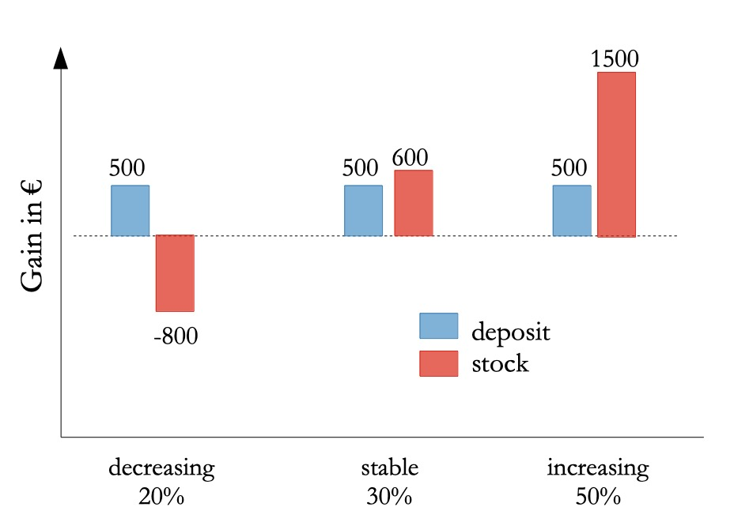
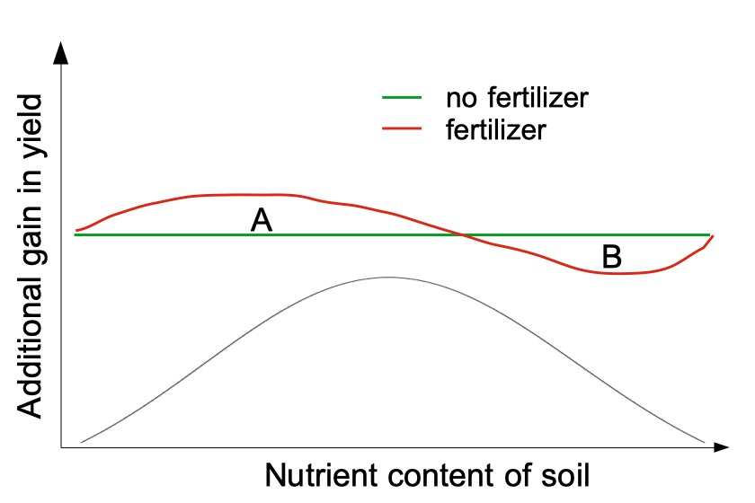

```{r setup, include=FALSE}
knitr::opts_chunk$set(echo = FALSE)
```

# What is the EVPI?

The expected value of perfect information (EVPI) is a concept developed in decision analysis. It quantifies the potential gain, in units of an output variable of a projection model, given accurate knowledge on the value a tested input variable will take. EVPI can help identify those variables for which more information would maximize the model output [@lanzanova2019]. When the output variable is monetary, the EVPI can be interpreted as the highest price that decision makers should be willing to pay for perfect information [@hubbard2014].

EVPI is calculated as the difference between: 

1. The expected value of the outcome variable $EV$ given accurate knowledge on the value that a tested input variable will take (perfect information - $PI$) and 

1. the expected maximum value ($EMV$) of the outcome variable given knowledge only about the probability distribution of the input variable [@Strong2014].

$$
EVPI = EV|PI - EMV
$$
Note that the imperfect information is defined as exact knowledge on the probability distribution of the input variable. It is not meant to capture knowledge uncertainty about the true value of the variable.

# EVPI with discrete probabilities

Calculating $EVPI$ with discrete probability distributions is relatively straightforward. We use the example of investment in the stock market vs. deposits (bonds): 



The expected value of deposit investment $Expdeposit$ is calculated as the probability of different states of the economy (x-axis) times the expected loss or gain in each condition (y-axis):
$$
Expdeposit : 0.2 \cdot 500 + 0.3 \cdot 500 
		+ 0.5 \cdot 500 		= 500 
$$
Likewise, expected value of stock investment $Expstock$ is the probability of each possible state of the economy (x-axis) times the expected losses or gains (y-axis):
$$ Expstock:   0.2 \cdot -800 + 0.3 \cdot 600
		+ 0.5 \cdot 1500		= 680 $$
		
Because  $Expstock$ is the more likely decision to result in a gain it is referred to as the Expected Maximum Value $EMV$.

The expected value of the decision *given* perfect information $EV|PI$ prior to decision is calculated as the sum of all the best options (always making the more gainful choice) multipled by the respective probabilities:
$$
EV|PI :     0.2 \cdot 500 + 0.3 \cdot 600 
		+ 0.5 \cdot 1500  		= 1030
$$

The Expected Value of Perfect Information $EVPI$ is then calculated as the difference between the decision given perfect information $EV|PI$ and the the Expected Maximum Value $EMV$.
$$
EVPI :      1030 – 680 		= 350
$$
Knowing the direction the market will go (having perfect information) before making our decision would help us take the best deision here. We should be willing to pay up to 350€ for perfect information on the future state of the economy. 

# EVPI with continuous probabilities

In the following example of an agricultural decision to apply fertilizer, we assume that the nutrient content of the soil will follow a normal distribution and that the additional gain in yield under the decision not to apply fertilizer will remain constant (<span style="color:green">green line</span>). 

We simulate a response of the application of fertilizer (<span style="color:red">red line</span>) to show that at a certain point the positive results of the application ends and the fertilizer starts to cause losses in yield. 

The expected gain in yield for the decision to not apply fertilizer is simply zero.
To calculate the expected gain in yield when applying fertilizer, we multiply the red line with the normal density distribution (analog to multiplying the gains and losses with the probability of the marked going in the respective directions in the example above) and add up the resulting areas under the curve: $A-B$. As the positive part $A$ is greater than the negative part $B$, the expected value of applying fertilizer has a small positive value. Therefore, applying fertilizer is the decision with the expected maximum value $EMV$ under imperfect knowledge. 



The expected value given perfect information $EV|PI$ is equal to $A$, because up to the nutrient content, where the line intersects zero, the best decision is to apply fertilizer, but for higher nutrient contents no fertilizer should be added. The $EVPI$ is then again caculated as the difference between $EV|PI$ and $EMV$.

$$
EVPI :      A – (A - B) = B
$$

# R Tools

The *empirical_EVPI()* function in R's decisionSupport library [@decisionSupport2017] calculates EVPI for a simple model with continuous data like the one above. The *multi_EVPI()* function does the same with more complex models with multiple variables.

# References


