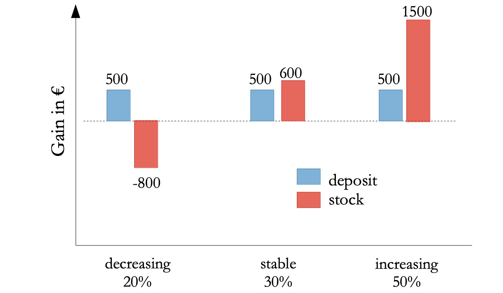

```{r setup, include=FALSE}
knitr::opts_chunk$set(echo = FALSE)
```

# Introduction
(<span style="color:red">I think it would be nice if we give a definition of EVPI following the perspective has been discussed in our last meeting on Friday (i.e. EVPI can be calculated in not only monetary unit, but also any unit that express the utility of decision makers) and in which aspect is it has been used (e.g. decision theory). For example: The expected value of perfect information (EVPI) is the concept often used in decision theory to discuss maximized expected utility. It is the differnce between the expected value when we have perfect information and the best expected value provided by alternatives (CITATION). EVPI has been commonly known as the highest price that decision makers are willing to pay for perfect informationn (CITATION). However, in the context of agricultural development,decision criterion might target to other preference rather than money. Therefore, we define EVPI as the potential gain given perfect information on all of the unknown model factors</span>) 

The expected value of perfect information (EVPI) can be used to identify the most critical knowledge gaps [@Coyle2008; @hubbard2014] and reveal variables for which more information can support decisions [@lanzanova2019]. 

$EVPI$ is calculated as the expected value $EV$ of the decision $D$ with perfect information $PI$, minus the expected value of the decision with current imperfect information $II$:

$$
EVPI = EV D|PI - EV D|II
$$

# Calculating EVPI

## Discrete data 

Calculating $EVPI$ with discrete data can be done using estimation of probabilities and possible gains or losses. We use the example of investment in the stock market vs. deposits (bonds): 



The expected outcome of the decision to invest in deposits $Expdeposit$ is calculated as the value (y-axis) times the probability of loss or gain under each condition (<span style="color:red">of what? economic growth?, it is not clear which variable on the x-axis</span>)  (x-axis):
$$
Expdeposit : 0.2 \cdot 500 + 0.3 \cdot 500 
		+ 0.5 \cdot 500 		= 500 
$$
The expected outcomes of the decision to invest in stocks $Expstock$ is the value of the decision times the probability of loss or gain under each condition: (<span style="color:red">same above</span>) 
$$ Expstock:   0.2 \cdot -800 + 0.3 \cdot 600
		+ 0.5 \cdot 1500		= 680 $$
Because  $Expstock$ is the more likely decision to result in a gain it is also known as the Expected Maximum Value $EMV$.

The expected value of the decision given perfect information $EV|PI$ is calculated as the sum of all the best options (always making the more gainful choice) multipled by the respective probabilities:
$$
EV|PI :     0.2 \cdot 500 + 0.3 \cdot 600 
		+ 0.5 \cdot 1500  		= 1030
$$
The Expected Value of Perfect Information $EVPI$ is caculated as the difference between the decision given perfect information $EV|PI$ and the the Expected Maximum Value $EMV$.
$$
EVPI :      1030 – 680 		= 350
$$

Knowing the direction the market will go (having perfect information) before making our decision would help us take the best deision here. We should be willing to pay up to 350€ for perfect information on the outcomes. (<span style="color:red">should this be on the variable in the x-axis, not on the outcomes?</span>) 

<br/> <!--- add a break to the next column --->

## Continuous data

In the following example of an agricultural decision to apply fertilizer, we assume that the nutrient content of the soil will follow a normal distribution and that the additional gain in yield under the decision not to apply fertilizer will remain constant (<span style="color:green">green line</span>). 

We simulate a response of the application of fertilizer (<span style="color:red">red line</span>) to show that at a certain point the positive results of the application ends and the fertilizer starts to cause losses in yield.

A and B are the 'areas under the curve' calculated by taking the integral of the curve (up to and from the point of intersection with the zero line, respectively).


In this case the expected value of the decision to apply no fertilizer is zero. The expected value of applying fertilizer is equal to $A - B$, which has a small positive value ($A$ is greater than $B$. This is the decision with the expected maximum value $EMV$ under uncertainty. 

The Expected Value given Perfect Information $EV|PI$ is equal to $A$ and $EVPI$ is caculated as the difference between this and $EMV$ ($A-B$).

$$
EVPI :      A – (A - B) = B
$$

# R Tools

The 'empirical_EVPI()' function in R's 'decisionSupport' library [@decisionSupport2017] calculates EVPI for a simple model like the one above. The 'multi_EVPI()' function does the same with more complex models with multiple variables.

# References


